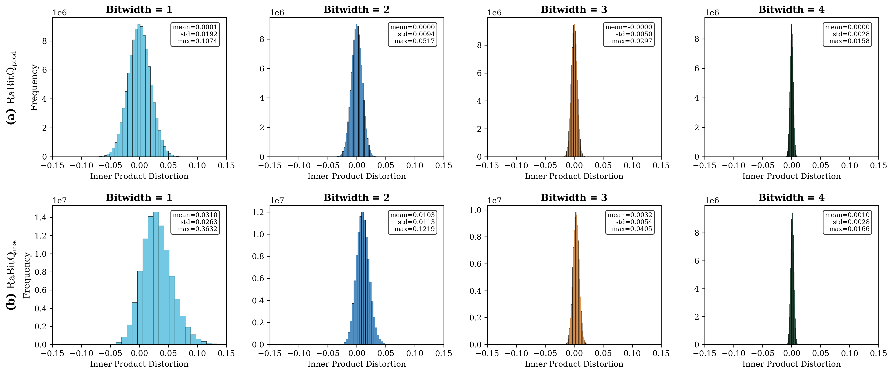
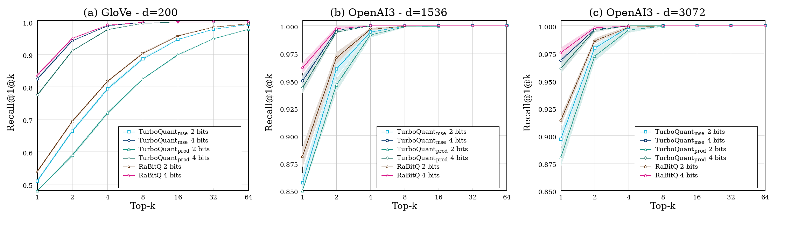
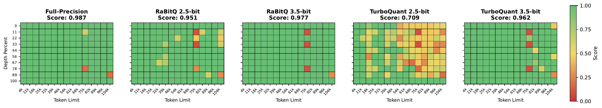

# Revisiting RaBitQ and TurboQuant: A Symmetric Comparison of Methods, Theory, and Experiments

> **Paper**: [arXiv:2604.19528](https://arxiv.org/abs/2604.19528)
>
> Jianyang Gao, Yutong Gou, Yuexuan Xu, Jifan Shi, Yongyi Yang, Shuolin Li, Raymond Chi-Wing Wong, Cheng Long

This repository contains the complete experimental code and results for the comparison of **RaBitQ** and **TurboQuant** — two vector quantization methods — across four aspects: quantization accuracy, ANN recall, quantization efficiency, and LLM KV-cache quantization.

## Abstract

This technical note revisits the relationship between RaBitQ and TurboQuant under a unified comparison framework. We compare the two methods in terms of methodology, theoretical guarantees, and empirical performance, using a reproducible, transparent, and symmetric setup. Our results show that, despite the claimed advantage of TurboQuant, TurboQuant performs worse than RaBitQ in most tested settings of inner-product estimation, nearest-neighbor search and KV cache quantization. We further find that several reported runtime and recall results in the TurboQuant paper could not be reproduced from the released implementation under the stated configuration. Overall, this note clarifies the shared structure and genuine differences between the two lines of work, while documenting reproducibility issues in the experimental results reported by the TurboQuant paper.

## Key Findings

### Methodology ([details in docs/algorithms.md](docs/algorithms.md))

At the method level, both RaBitQ and TurboQuant apply a random rotation as their first step and exploit the resulting distributional properties to design their respective quantization schemes as well as analyzing the unbiasedness and error bounds for inner product estimation. The key difference: RaBitQ uses a uniform codebook obtained by shifting unsigned integers and estimates inner products without decoding; TurboQuant uses a non-uniform codebook constructed by *k*-means and requires codebook lookup for decoding.

### Theoretical Guarantees ([details in docs/theoretical_guarantees.md](docs/theoretical_guarantees.md))

- **RaBitQ**: provably achieves the asymptotically optimal space-distortion trade-off established by Alon and Klartag (2017), with a bit-width that grows with the failure probability δ at the rate of **log log(1/δ)**.
- **TurboQuant**: provides only a variance guarantee on its estimator. Converting this to a tail bound via Chebyshev's inequality yields a dependence that grows as **log(1/δ)**, which is exponentially worse than the optimal rate.

### Experimental Results

#### 1. Quantization Accuracy ([details in accuracy/RESULTS.md](accuracy/RESULTS.md))

In quantization accuracy, RaBitQ_prod matches or outperforms TurboQuant_prod across all tested bit widths.

**Distribution of Inner Product error for RaBitQ** (top: prod, bottom: mse, bitwidths 1–4)



**Distribution of Inner Product error for TurboQuant** (top: prod, bottom: mse, bitwidths 1–4)


#### 2. Quantization Efficiency ([details in efficiency/RESULTS.md](efficiency/RESULTS.md))

| Approach | d=200 | d=1536 | d=3072 |
|----------|-------|--------|--------|
| RaBitQ (CPU) | 0.125 | 1.003 | 4.176 |
| RaBitQ_fastOn-FWHT (CPU) | 0.085 | 0.143 | 0.218 |
| RaBitQ (GPU) | 0.009 | 0.065 | 0.152 |
| RaBitQ_fastOn-FWHT (GPU) | **0.003** | **0.008** | **0.013** |
| TurboQuant (GPU) | 0.011 | 0.114 | 0.276 |

*Quantization time (in seconds) for different approaches across various dimensions using 4-bit quantization.*

In quantization efficiency, RaBitQ is substantially faster than TurboQuant on the same hardware, and its CPU implementation is competitive with TurboQuant on an A100 GPU. Furthermore, the runtime results reported in the TurboQuant paper could not be reproduced from the released implementation under the stated hardware configuration.

#### 3. Nearest Neighbor Search ([details in ann/RESULTS.md](ann/RESULTS.md))

Recall@1@*K* on GloVe-200, OpenAI3-1536, and OpenAI3-3072, averaged over 10 runs with one-standard-deviation bands.



In nearest neighbor search, RaBitQ consistently achieves higher recall than both TurboQuant variants across all datasets and bit widths. We also observe that TurboQuant_mse consistently achieves higher recall than TurboQuant_prod, even though the latter is the variant designed for inner-product estimation.

#### 4. KV Cache Quantization ([details in docs/kv_cache_results.md](docs/kv_cache_results.md))

##### Needle-In-A-Haystack on `meta-llama/Meta-Llama-3.1-8B-Instruct`



| Method | Score |
|--------|-------|
| Full-Precision | 0.987 |
| RaBitQ 3.5-bit | 0.977 |
| TurboQuant_mse 3.5-bit | 0.962 |
| RaBitQ 2.5-bit | 0.951 |
| TurboQuant_mse 2.5-bit | **0.709** |

TurboQuant degrades sharply at 2.5-bit, with failures concentrated at long contexts (mean score falls from 0.898 at ≤32k to 0.615 at >32k).

##### LongBench-E

| Model | Method | SingleQA | MultiQA | Summ | Few shot | Synthetic | Code | Avg |
|-------|--------|----------|---------|------|----------|-----------|------|-----|
| `meta-llama/Meta-Llama-3.1-8B-Instruct` | Full Cache (16-bit) | 45.39 | 45.76 | 26.38 | 68.60 | 59.12 | 48.00 | 50.39 |
| `meta-llama/Meta-Llama-3.1-8B-Instruct` | RaBitQ 2.5-bit | **43.74** | **45.49** | **22.56** | **67.38** | **58.96** | **44.34** | **48.64** |
| `meta-llama/Meta-Llama-3.1-8B-Instruct` | TurboQuant_mse 2.5-bit | 42.20 | 44.36 | 21.89 | 67.37 | 58.94 | 42.14 | 47.78 |
| `meta-llama/Meta-Llama-3.1-8B-Instruct` | RaBitQ 3.5-bit | **44.85** | 45.56 | 24.70 | 67.90 | **59.53** | **45.58** | 49.55 |
| `meta-llama/Meta-Llama-3.1-8B-Instruct` | TurboQuant_mse 3.5-bit | 44.11 | **45.75** | **25.17** | **68.11** | 59.49 | 45.53 | **49.57** |
| `mistralai/Ministral-8B-Instruct-2410` | Full Cache (16-bit) | 51.29 | 57.28 | 25.92 | 69.37 | 58.16 | 56.10 | 54.28 |
| `mistralai/Ministral-8B-Instruct-2410` | RaBitQ 2.5-bit | **49.39** | **56.39** | **22.90** | **68.71** | **58.00** | **52.16** | **52.60** |
| `mistralai/Ministral-8B-Instruct-2410` | TurboQuant_mse 2.5-bit | 47.86 | 55.58 | 21.30 | 68.64 | **58.00** | 51.00 | 51.80 |

In KV cache quantization, RaBitQ shows clear gains at 2.5-bit, and the two methods have comparable performance at 3.5-bit.

## Repository Structure

```
├── docs/                Algorithm comparison, theoretical guarantees, bug analysis, shared figures
│   └── figures/             All paper figure assets
├── accuracy/            Quantization accuracy experiments (paper Section 4.1)
├── ann/                 Nearest neighbor search experiments (paper Section 4.3)
├── efficiency/          Quantization efficiency experiments (paper Section 4.2)
│   ├── cpu/                 CPU side (C++)
│   └── gpu/                 GPU side (Python + CUDA)
├── kv_cache/            KV-cache quantization experiments (paper Section 4.4)
│   ├── kvcache_quant/       Unified quantization framework (pluggable RaBitQ / TurboQuant sketch)
│   ├── llm_rabitq/          RaBitQ CUDA quantization kernel
│   ├── llm_turbo/           Patched TurboQuant LLM implementation (fixes 4 bugs from the original code)
│   └── eval/                Evaluation scripts (LongBench-E, Needle-in-a-Haystack)
└── RaBitQ-Library/      RaBitQ C++ header-only library (git submodule)
```

Each experiment directory has its own `README.md` (run instructions) and `RESULTS.md` (results & analysis).

## Documentation

- [`docs/algorithms.md`](docs/algorithms.md) — Comparison of methodology under a unified framework (paper Section 2)
- [`docs/theoretical_guarantees.md`](docs/theoretical_guarantees.md) — Comparison of theoretical guarantees (paper Section 3)
- [`docs/turbo_bugs.md`](docs/turbo_bugs.md) — Detailed analysis of four bugs in the original TurboQuant LLM code

## Setup

### Git Submodules

Initialize the submodules before building any C++ code:

```bash
git submodule update --init --recursive
```

### Dependencies

- **C++ code**: CMake >= 3.10, C++17, OpenMP
- **ANN experiments**: `pip install -r ann/requirements.txt`
- **KV-cache experiments**: `pip install -r kv_cache/requirements.txt`
- **KV-cache CUDA extension**:
  ```bash
  cd kv_cache/llm_rabitq
  TORCH_CUDA_ARCH_LIST="8.0" pip install -e . --no-build-isolation  # adjust arch for your GPU
  ```

## Quick Start

### Quantization accuracy (`accuracy/`)

```bash
cd accuracy
python get_dataset.py --dim 1536
python turbo_quant.py --dim 1536 --bitwidth 2 --metric ip-error
# RaBitQ: build, then run ./rabitq <bitwidth> <mse|prod>
```

### Nearest neighbor search (`ann/`)

```bash
cd ann
python prepare_all_datasets.py
cmake -S . -B build && cmake --build build -j
python run_all_experiments.py --rabitq-binary build/bin/rabitq
python plot_recall_figure.py
```

### Quantization efficiency (`efficiency/`)

CPU: `efficiency/cpu/`, GPU: `efficiency/gpu/`. See the README in each subdirectory.

### KV-cache quantization (`kv_cache/`)

```bash
cd kv_cache
bash eval/run_longbench_eval.sh --backend rabitq --bits 2.5 --gpu 0
python eval/run_needle.py --backend rabitq --bits 2.5
```

## Citation

If this repository is helpful for your research, please cite:

```bibtex
@article{gao2025revisiting,
  title={Revisiting RaBitQ and TurboQuant: A Symmetric Comparison of Methods, Theory, and Experiments},
  author={Gao, Jianyang and Gou, Yutong and Xu, Yuexuan and Shi, Jifan and Yang, Yongyi and Li, Shuolin and Wong, Raymond Chi-Wing and Long, Cheng},
  journal={arXiv preprint arXiv:2604.19528},
  year={2025}
}
```

## License

Apache License 2.0
