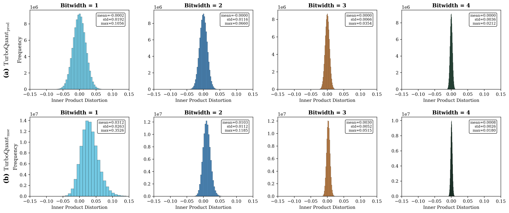

# Quantization Accuracy Results

Corresponds to Section 4.1 of the paper.

## Setup

Following the TurboQuant paper, we use the DBpedia Entities dataset (1,536-dimensional) and randomly sample 100,000 points as the training set and extract 1,000 distinct entries as the query set.

In the TurboQuant paper, two versions are provided, namely one denoted by TurboQuant_prod for unbiased inner product estimation and the other denoted by TurboQuant_mse for vector reconstruction (with minimized MSE). RaBitQ can also support inner product estimation and vector reconstruction. We denote the RaBitQ for unbiased inner product estimation by RaBitQ_prod and that for vector reconstruction by RaBitQ_mse. We then use the two versions of both methods to quantize the training set and estimate the inner products between the training set and the query set based on the quantization codes of training set. We vary the bit widths for quantization and measure the estimation error distributions.

We note that RaBitQ_mse was not designed for inner-product estimation; we include it here solely for completeness of the comparison. In the rest part of this section, unless otherwise specified, RaBitQ refers to RaBitQ_prod.

## Results

### Figure 1: Distribution of Inner Product error for RaBitQ

Top row: RaBitQ_prod (bitwidths 1–4). Bottom row: RaBitQ_mse (bitwidths 1–4).

### Figure 2: Distribution of Inner Product error for TurboQuant

Top row: TurboQuant_prod (bitwidths 1–4). Bottom row: TurboQuant_mse (bitwidths 1–4).

## Observations

### Mean error

Both RaBitQ_prod and TurboQuant_prod maintain a mean error of approximately zero across all bit widths, confirming that both variants are effectively unbiased estimators for inner-product estimation. For the MSE-optimized variants, both methods exhibit a slight positive bias that diminishes as the bit width increases.

### Standard deviation and maximum error

For the inner product estimation, RaBitQ_prod achieves lower standard deviation and maximum error than TurboQuant_prod at bit widths greater than 1, indicating that RaBitQ produces more tightly concentrated and reliable estimates in the setting where both methods are directly comparable.

### Summary

Taken together, these results show that TurboQuant offers no clear and consistent advantage over RaBitQ. In the setting most relevant to inner-product estimation, where the comparison is between the unbiased variants RaBitQ_prod and TurboQuant_prod, RaBitQ is more stable with smaller std and max errors across most of the tested bit widths.
